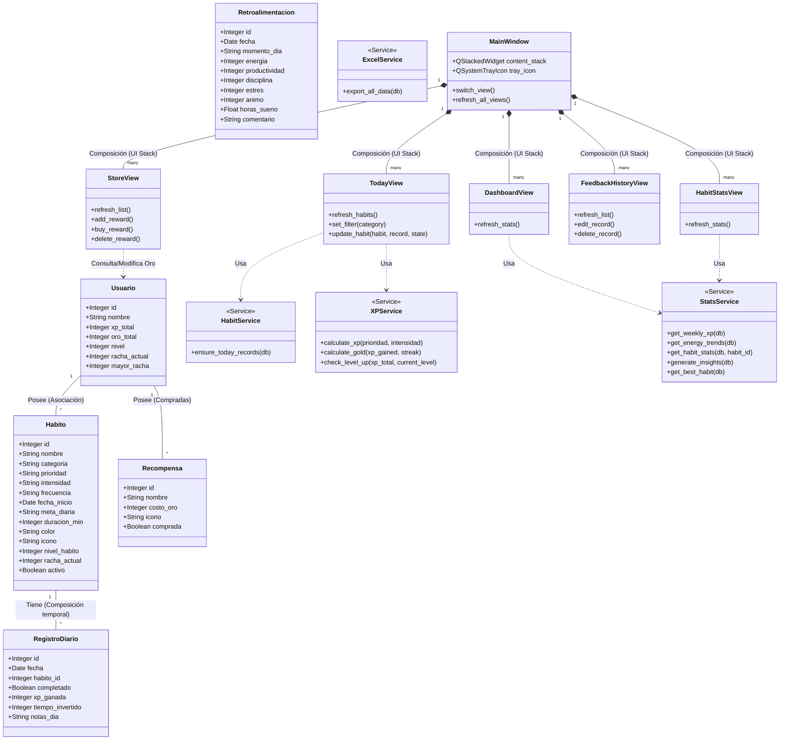

# Documentación Técnica y Arquitectura del Sistema
**Proyecto:** Habitos Games - Pro Edition
**Rol Objetivo:** Arquitectura de Software & Guía de Mantenimiento a 5 Años.

Este documento define la estructura, reglas conceptuales y el modelado técnico necesario para comprender, modificar y escalar el sistema sin fricción. Fue creado con el objetivo de preservar la integridad del sistema a largo plazo.

---

## 1. Diagrama de Clases Completo 🏛️

El sistema se compone de entidades de Dominio (Modelos de Base de Datos apoyados en SQLAlchemy ORM) y Controladores Gráficos (Views de PyQt6 apoyadas por Services estáticos).



### Justificación y Responsabilidad (SOLID)
* **Principio de Responsabilidad Única (SRP)**: Cada `View` (ej. `TodayView`) se encarga ÚNICAMENTE de "Pintar la UI y recibir clics". Delegan los cálculos complejos a la capa `Service`.
* **Segregación de Interfaces / Modelos**: La tabla `RegistroDiario` (acción de cumplir un hábito hoy) está totalmente separada de `Habito` (la definición del hábito). Esto permite una escalabilidad histórica sin romper los metadatos base.

---

## 2. Diagrama de Flujo del Sistema 🛤️

### Ciclo de Vida: Desde el Clic en la Interfaz hasta la BdD
1. **Flujo Creador**: Interfaz Gráfica (`CreateHabitView`) -> Clic en Guardar -> Reglas de UI extraen texto -> Creación del Objeto SQLAlchemy (`Habito(nombre=x, ...)`) -> `db.add()` y `db.commit()` -> Invocación a `main_win.refresh_all_views()`.
2. **Flujo de Modificación (El Core Loop)**:
   * **Lectura**: Al iniciar `TodayView`, consulta `RegistroDiario`. Si el hábito no tiene un registro *hoy*, invoca `HabitService.ensure_today_records()` para pre-crear campos vacíos silenciosamente.
   * **Modificación**: Usuario hace clic en un `QCheckBox`. Emite una señal `stateChanged`.
   * **Inyección de Reglas**: Entra en `update_habit()`. Si marcó "Completo", la interfaz llama a `XPService.calculate_xp()`.
   * **Mutación**: Asigna el XP retornado al récord de DB. Evalúa el `total_xp` del Usuario y llama a `check_level_up`.
   * **Sincronización de UI**: Si se guarda en BD con éxito (`commit`), emite señal al `MainWindow` para actualizar automáticamente *Estadísticas* o el *Dashboard*.
3. **Flujo de Eliminación**: Principalmente en `FeedbackHistoryView` -> Confirmación por `QMessageBox` emergente -> `db.delete(record)` -> `db.commit()`.

---

## 3. Arquitectura del Sistema 🏗️

El sistema utiliza **MVC (Model-View-Controller)** evolucionado hacia un paradigma de **Service Layer Pattern (Capa de Servicios)**.

### Las Capas
1. **Capa de Presentación (`/ui`)**: Contiene únicamente lógica de dibujado (PyQt6), estilos (QSS) y captura de eventos de mouse/teclado. *No debe hacer matemáticas complejas*.
2. **Capa de Aplicación / Servicios (`/services`)**: Módulo intermedio. Aquí es donde **viven las reglas de negocio críticas** (¿Cuánto XP da un hábito Fácil vs Extremo? ¿Cuál es la curva de Level-Up? ¿Cómo se aglomeran datos para los gráficos?). Funciona como fachada ("Controller") para las Vistas.
3. **Capa de Dominio (`/models`)**: Archivos puramente declarativos. Mapean las tablas SQL a objetos Python nativos protegiendo los tipos de datos en la sintaxis.
4. **Capa de Infraestructura (`/database`)**: Archivos como `db_manager.py` (Manejo de SQLAlchemy e inyección del motor y contexto local conectándose a un archivo de SQLite físico local).

---

## 4. Flujo de Datos 🔄

Tomando como ejemplo un **"Guardado de Feedback"**:
1. **Visualización (`feedback_view.py`)**: PyQt extrae enteros desde `QSlider.value()`.
2. **Validación y Transformación**: El código de la UI mapea opciones como `["🌅 Mañana", "☀️ Tarde", "🌙 Noche"]` al string exacto. Evalúa que los campos no estén vacíos.
3. **Guardado (Write)**: Se inyectan en el constructor ORM (`Retroalimentacion(...)`). Se realiza `db.add()` y por último `db.commit()` (ejecutando INSERT en SQLite).
4. **Actualización Relacional (Read / Re-Draw)**: `mainWindow.refresh_all_views()` ordena a la capa UI que vuelvan a conectarse a la DB vía `db.query(..).all()`.
5. **Re-Transformación**: Las vistas inician `canvas.axes.clear()`, solicitan datos a `StatsService` que agrupa por días, y el motor de dibujo `Matplotlib` recalcula el gráfico.

---

## 5. Patrones de Diseño Implementados 🧩

* **Model-View-Controller (MVC adaptado)**: Se separa estrictamente qué se ve (UI) de dónde se guarda (Models) usando la capa intermedia de Servicios.
* **Service Layer**: Para cálculos recurrentes vectoriales que de otra manera inflarían inútilmente Modelos y Vistas. (Ejs: `StatsService`, `XPService`).
* **Dependency Injection (Básica)**: Todos los constructores gráficos (Ej: `def __init__(self, db_session)`) exigen recibir la instancia de BD en vez de intentar instanciar una propia. Ideal para Mocks en Testing Unitario.
* **Singleton (Patrón Semántico)**: Existe una única instancia maestra de `MainWindow` y una única `SessionLocal` global de base de datos nacida de la factoría de SQLAlchemy.
* **Observer (Reactividad Emulada PyQt)**: Utilización intensiva de "Signals y Slots". Ej: Cuando `QComboBox.currentIndexChanged` ocurre, reacciona conectándose asíncronamente a los métodos correspondientes.
* **DTO (Data Transfer Object)**: Técnicamente los Modelos base de SQLAlchemy funcionan como proxies de DTO para transitar mediante RAM.

---

## 6. Estructura de Carpetas 📂

```plaintext
/habitos-games-python
├── database/
│   ├── db_manager.py     # Creador del Engine (Singleton SQL)
│   └── db.sqlite         # Data final binaria Local
├── models/
│   ├── habito.py         # SQLAlchemy Base (Entidad)
│   ├── registro.py       # Intersección Histórica (Data Transaccional Diaria)
│   ├── retroalimentacion.py
│   └── usuario.py        # Estado Global
├── services/
│   ├── excel_service.py  # Exportación de Datasets
│   ├── habit_service.py  # Automatismos Diarios (Inicialización)
│   ├── stats_service.py  # Aggregations, Math y Querying Complejo
│   └── xp_service.py     # Lógica central del sistema de progresión
├── ui/
│   ├── create_habit_view.py 
│   ├── dashboard_view.py 
│   ├── feedback_history_view.py
│   ├── feedback_view.py
│   ├── habit_stats_view.py
│   ├── main_window.py    # Enrutador Central
│   ├── stats_view.py
│   └── styles.py         # Abstracción de UI (Sistema tipo SCSS / CSS variables de PyQt6)
├── utils/
│   └── check.png         # Activos Visuales
├── main.py               # ROOT BOOTSTRAPPER (Ejecutable del programa)
└── README.md             # Notas breves del repositorio general
```

---

## 7. Protocolo de Arquitectura y Mantenimiento a 5 Años 🛠️

Si heredas este código con el propósito de refactorizar o agregar features sin destrozar la base de código actual:

### A. Para Agregar un Nuevo Campo en Base de Datos (Ej: Agregar "Tipo de Moneda" al Habito)
1. Modifica en `/models/habito.py` adicionando el nuevo `Column(String, default=...)`.
2. ¡ATENCIÓN! SQLite tradicional NO permite migraciones nativas destructivas fácilmente. Si no configuras Alembic, debes hacer drop de tablas manualmente durante la dev. Se recomienda borrar `db.sqlite` temporalmente.
3. Actualiza cualquier Form en el directorio `ui/` que recolecte este dato y agrégalo a los `*kwargs` del ORM en guardado.

### B. Para Agregar Nueva Vista / Pestaña (Ej: Componente de Amigos)
1. Crear `/ui/friends_view.py`. Heredar de `QWidget`, contener `__init__(self, db_session)`.
2. Importar el archivo nuevo en `main.py`.
3. Instanciar e insertar la vista en la cola: `window.content_stack.addWidget(friends_view)`.
4. Ir a `/ui/main_window.py`. Crear un botón lateral `self.btn_friends = self.create_nav_btn("Amigos", INDEX)`. Re-indexar los clics lógicamente.

### C. Para Agregar un Nuevo Servicio (Ej: Notificaciones Push Locales)
1. Crear `/services/notification_service.py` con decoradores `@staticmethod` o `@classmethod`.
2. Citarlo *únicamente* en controladores (Views) o disparadores (`MainWindow`). 
3. Mantener agnóstico a la Interfaz de Usuario para poder reusarlo mediante comandos terminales u otras plataformas.

### Reglas Sagradas Que NO Se Deben Romper:
* **Nunca iterar Curies N+1 en Dibujos Visuales**: Jamás ejecutes un Query SQL pesada (Ej: `self.db.query(...)`) dentro de un bucle "FOR" que se encarga de pintar gráficos, para evitar bloquear el GUI thread. Centraliza y pre-carga la data en variables en `StatsService`.
* **Abstracción CSS Obligatoria**: No utilices código hardcoded de estilo tipo `button.setStyleSheet("background: red")` bajo ninguna circunstancia si es solucionable mediante una clase global. Debes usar `widget.setObjectName("ID_Global")` definido en `ui/styles.py` para aplicar estilos maestros unánimemente.
* **Separación de Reactividad por Controlador Global**: Si insertas, eliminas o actualizas una base de datos desde la Vista X, la Vista Y no debe escuchar a la Vista X. Ambas deben depender ciegamente del comando `self.window().refresh_all_views()` para sincronizar el estado. 

*Esta arquitectura asegura que el crecimiento caótico se limite al máximo, brindando mantenibilidad absoluta predecible para equipos distribuidos grandes.*
