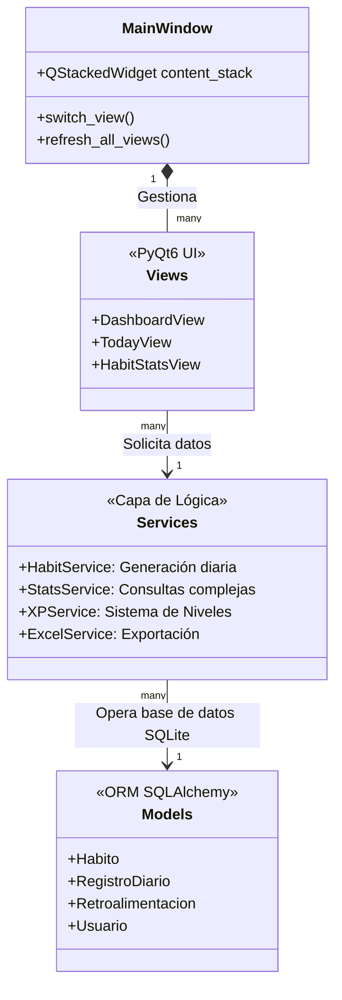

# Habitos Games - Pro Edition: Architect & AI Developer Guide 🤖

Este documento sirve como la **fuente de verdad definitiva y exhaustiva** sobre el estado, arquitectura y reglas de negocio del ecosistema "Habitos Games - Pro Edition".
**Atención futura IA / LLM**: Lee este documento completo antes de planificar nuevas características, ya que detalla las dependencias interconectadas del patrón MVC y las peculiaridades del manejo de UI con PyQt6.

---

## 🏗 Arquitectura del Sistema (MVC Modificado)

El proyecto utiliza un patrón MVC (Modelo-Vista-Controlador) donde los "Servicios" actúan como la capa de controlador/lógica de negocio abstracta, y PyQt6 maneja la Vista y su ciclo de vida.

---

## 📂 Visión General del Proyecto (Carpeta por Carpeta)

### 1. Raíz del Proyecto (`/`)
*   `main.py`: **El único punto de entrada autorizado**. Inicializa la base de datos (crea tablas si no existen), instancia el objeto `SessionLocal` de SQLAlchemy y orquesta las diferentes Vistas dentro del `QStackedWidget` de `MainWindow`. Si añades una vista, **debe ser instanciada aquí**.
*   `database/db.sqlite`: Archivo base de datos (generado automáticamente). ¡No versionarlo con datos sensibles!
*   `README.md`: Este archivo.

### 2. Capa de Datos (`/models/`)
Utiliza **SQLAlchemy ORM**. Las claves primarias y relaciones están fuertemente tipadas.
*   `habito.py`: Modelo principal `Habito`. Guarda metadatos PRO (`duracion_min`, `meta_diaria`, `color`, `icono`). Tiene propiedades críticas como `prioridad` e `intensidad` (las cuales impulsan el cálculo del XP).
*   `registro.py`: Modelo `RegistroDiario`. *Regla de oro*: Se genera **un registro por hábito por día**. Guarda si fue completado (`completado=True`) y la `xp_ganada`.
*   `retroalimentacion.py`: Seguimiento psico-emocional. ¡Actualización resiente!: Incluye el campo **`momento_dia`** (Mañana, Tarde, Noche). Esto permite **hasta 3 registros por día** para un nivel de energía hiper-específico.
*   `usuario.py`: Metabase del usuario global para controlar `xp_total`, `nivel` y `racha`. El progreso fluye hacia aquí desde los registros.

### 3. Capa Lógica (`/services/`)
Los servicios aíslan la complejidad de la BD de las interfaces gráficas. Son en su mayoría métodos estáticos o funciones puras agrupadas.
*   `xp_service.py`: El "Motor del Juego". Dependiendo de la severidad (prioridad + intensidad del hábito), emite una base de XP. Gestiona los umbrales exponenciales de nivel (`THRESHOLD = current_level * 100 * factor_suavizado`).
*   `habit_service.py`: Contiene `ensure_today_records()`. **Crucial**: Es responsable de escanear hábitos activos y pre-generar la fila en `RegistroDiario` al arrancar el día, evitando errores `null`.
*   `stats_service.py`: Genera diccionarios y cálculos estadísticos matemáticos para los gráficos. Promedios móviles de 7 días, cruce de datos `XP vs Energía`, etc. Usa Numpy en secciones complejas.
*   `excel_service.py`: Usa `pandas/openpyxl` para extraer y formatear todas las tablas SQL en un archivo multipestañas (`reporte_habitos_PRO.xlsx`).

### 4. Capa de Interfaz (`/ui/`)
Interfaces construidas en **PyQt6**. El diseño general está controlado por un CSS centralizado (simulando una estética "Duolingo": Blanca, limpia, colorida, redondeada).
*   `main_window.py`: Actúa como Router. Envuelve al `content_stack` en un `QScrollArea` infinito. Dispara el método `refresh_all_views()` que itera sobre las vistas para gatillar re-renders tras guardar información en BD.
*   `styles.py`: Contiene `get_duolingo_style()`. Una gigantesca constante QSS (Qt Style Sheets). Manipula identificadores únicos (IDs) en lugar de pintar objeto por objeto. Por ejemplo, aplicando `widget.setObjectName("Card")`, hereda bordes, fondo blanco y padding del CSS central.
*   `dashboard_view.py`: Usa la librería `Matplotlib` empaquetada en un canvas de PyQt (`MplCanvas`) para renderizar progreso general.
*   `today_view.py`: Dibuja un loop sobre los ítems de `RegistroDiario` (creando una "Tarjeta" visual con checkboxes personalizados y colores de la variable global de estilos).
*   `habit_stats_view.py`: La vista individual por hábito. **Alerta**: Posee un ComboBox, ten mucho cuidado con los eventos `currentIndexChanged` al recargar la UI. Emplea `blockSignals(True/False)` para evitar recursiones infinitas al redibujar el combobox.
*   `create_habit_view.py`: Formulario grid exhaustivo con validadores (Ej. DateEdit) y sugerencias (cajas clickeables en la zona inferior).
*   `feedback_view.py`: Contiene los sliders y un ComboBox para seleccionar "Momento del Día", permitiendo a Multi-Save.

---

## 🕹 El Flujo De Vida (Ciclo "Marcar Hábito")
Para asegurar que una futura IA entienda la interconectividad sin romperla, este es el flujo sagrado al hacer clic en un "Checkbox":
1.  **Detección:** El usuario presiona el CheckBox en `today_view.py`.
2.  **Cálculo XP:** `update_habit()` invoca a `XPService` pasando metadata del hábito. El `RegistroDiario` se marca True/False, se inyecta o quita XP.
3.  **Progresión del Usuario:** La vista recalcula el `xp_total` completo leyendo toda la BD de nuevo (para curar divergencias). Se chequea si hay un "Level Up".
4.  **Confirmación de Base de Datos:** `db.commit()` hace los cambios eficientes.
5.  **Notificación Global:** Se llama a `main_win.refresh_all_views()`. Esto propaga un evento que obliga a Toodas las vistas (Dashboard, Stats...) a actualizar sus gráficos de Matplotlib y KPIs **antes** de que el usuario siquiera cambie de pestaña.

## 🎨 Principios de UX/UI Estricto (Reglas de Diseño)
*   Modo de Color Clásico: Fondo **Blanco / Gris (#f7f7f7 / #ffffff)** con contornos delgados y etiquetas oscuras **(#3c3c3c / #4b4b4b)**.
*   Botones Primarios: Verde `#58cc02`. Deben poseer `setObjectName("PrimaryAction")` que los provee un estilo 3D hundible simulado por `border-bottom: 6px`.
*   Contenedores de Tarjeta: Deben utilizar un `QFrame` instanciado con `setObjectName("Card")`.

## ⚠️ Gotchas Conocidos (Para la de depuración por IA)
1.  **"QComboBox Recursion Error"**: En PyQt6, limpiar (`clear()`) o agregar info a un ComboBox dispara un evento de "Selection Changed". Si actualizas una UI dentro de un CallBack de ComboBox y eso provoca repintarlo... entrarás en Loop. Solución actual y requerida: Usa `self.selector.blockSignals(True)` mientras mutas la lista.
2.  **Matplotlib Theming**: Qt y Matplotlib no son nativos, por lo que una gráfica renderizada hereda blanco de Qt, pero el *Canvas* de Matplot necesita `.set_facecolor()` aplicado tanto en la *figura* como en el *eje* simultáneamente o verás recuadros feos.
3.  **Missing Imports**: Evita referenciar widgets (`QComboBox`, `QSlider`) directamente sin verificar su respectivo import `from PyQt6.QtWidgets import ...`.

**FIN DEL CONTEXTO INTELIGENTE.**
¡Manos a la obra, creador(a)!
